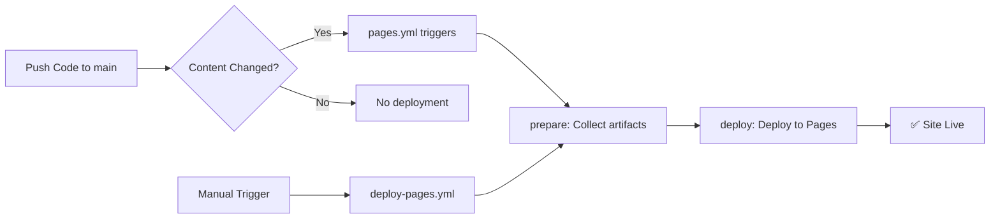

# GitHub Actions & Pages Setup

## 🎯 Quick Start

### 1. Enable GitHub Pages

1. Go to **Settings** → **Pages**
2. Select **"GitHub Actions"** as Source
3. Click **Save**

### 2. Deploy Your Site

**Option A: Manual Deployment**
```
Actions → "Deploy Static Site to GitHub Pages" → Run workflow
```

**Option B: Automatic (on push)**
- Push changes to `main` branch in any of:
  - `public/`, `docs/`, `build/`, `dist/`, `website/`
- Workflow triggers automatically
- Site updates in ~1-2 minutes

---

## 📦 What's Included

### Workflows

| Workflow | Trigger | Purpose |
|----------|---------|----------|
| `deploy-pages.yml` | Manual | Deploy with custom options |
| `pages.yml` | Auto (push) | Auto-deploy on content change |
| `validate.yml` | Push/PR | Validate workflow syntax |

### Documentation
- `WORKFLOWS.md` - Detailed workflow guide
- `.github/scripts/` - Validation utilities

---

## 🚀 Deployment Workflow



---

## 📊 Monitoring

### Check Deployment Status
1. Go to **Actions** tab
2. Click workflow run
3. View job logs in real-time

### View Deployment Details

Workflow output includes:
- ✅ Artifact ID
- 📦 File count & size
- 🔗 Live page URL
- ⏱️ Deployment time

---

## 🔧 Configuration

### Change Artifact Source

Edit `.github/workflows/pages.yml`:

```yaml
on:
  push:
    paths:
      - 'dist/**'  # Change this to your directory
```

### Adjust Retention Days

**Manual deployment:**
```
Run workflow → Set "retention_days" input → Run
```

**Auto deployment:**
Edit `.github/workflows/pages.yml`:
```yaml
with:
  retention-days: 60  # Change retention
```

---

## 🆘 Troubleshooting

### Workflow fails

**Check:**
1. Pages enabled in Settings
2. Source set to "GitHub Actions"
3. Content exists in one of:
   - `public/`, `docs/`, `build/`, `dist/`, `website/`

### Site shows 404

**Fix:**
1. Ensure `index.html` exists
2. Re-run deployment
3. Wait 2-3 minutes for propagation

### Slow deployment

**Optimize:**
- Reduce artifact size (remove node_modules, .git, etc.)
- Use `dist/` or `build/` instead of entire repo
- Lower retention days if not needed

---

## 🔐 Security

✅ **No secrets required** - Uses GitHub OIDC  
✅ **Minimal permissions** - Only what's needed  
✅ **No PAT tokens** - Built-in authentication  
✅ **Automatic cleanup** - Artifacts auto-removed after retention  

---

## 📚 Resources

- [GitHub Pages Docs](https://docs.github.com/en/pages)
- [GitHub Actions Docs](https://docs.github.com/en/actions)
- [WORKFLOWS.md](./.github/WORKFLOWS.md) - Detailed guide

---

## 💡 Pro Tips

1. **Rollback Site**
   - Find previous artifact in Actions
   - Re-deploy that artifact ID
   
2. **Preview Before Deploy**
   - Test locally: `python -m http.server` in artifact dir
   - Push to test branch
   - Deploy from main when ready
   
3. **Monitor Costs**
   - Check Actions usage in Settings → Billing
   - Workflows are free for public repos
   - Private repos have monthly limits

---

## ✨ Features

✅ Auto-detect artifact source  
✅ Fallback content if empty  
✅ File count & size reporting  
✅ Artifact ID tracking  
✅ Shallow clone (fast)  
✅ Error handling  
✅ Pretty summaries  
✅ Path-based triggers  
✅ Concurrency control  
✅ Environment protection (optional)  

---

*Updated: 2025-12-26*
